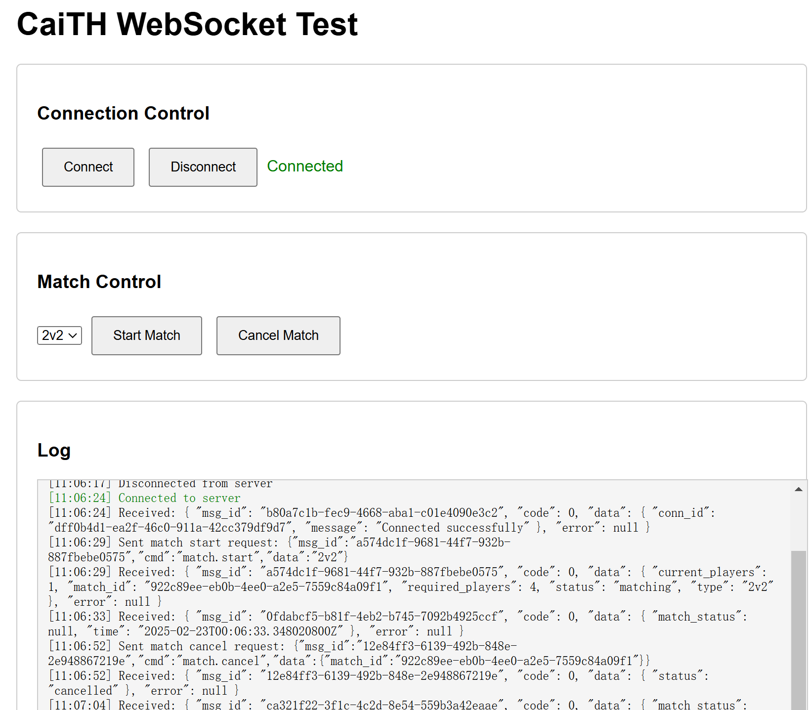

# CaiTH-server
CaiTH (Cai Treasure Hunt) 是一个基于 WebSocket 的宝藏寻找游戏服务器，还在继续开发。



## 项目架构

```
CaiTH-server/
├── Cargo.toml
├── .env                            # Environment variables
├── src/
│   ├── main.rs                     # Program entry point
│   ├── config/
│   │   └── mod.rs                  # Configuration management
│   ├── error.rs                    # Error handling
│   ├── gateway/                    # WebSocket gateway
│   │   ├── mod.rs
│   │   ├── handler.rs              # Connection handler
│   │   └── connection_manager.rs   # Connection state management
│   ├── matchmaking/                # Matchmaking service
│   │   ├── mod.rs
│   │   └── service.rs              # Matchmaking logic
│   ├── models/                     # Data models
│   │   ├── mod.rs
│   │   ├── message.rs              # Message definitions
│   │   └── game.rs                 # Game-related structures
│   └── db/                         # Database interaction
│       ├── mod.rs
│       ├── hasura_client.rs        # Hasura GraphQL client
│       └── hasura_match_repository.rs # Match-related database operations
└── README.md
```

## 已实现功能

### WebSocket 网关
- WebSocket 连接管理
- 消息路由
- 连接状态维护
- 心跳检测

### 匹配系统
- 多种匹配模式 (1v1, 2v2, 5v5)
- 房间池管理
- 动态房间创建/回收
- 玩家加入/退出管理

### 消息协议
```json
// 客户端到服务器 (C2S)
{
    "msg_id": "uuid-string",
    "cmd": "command-string",
    "data": "command-data"
}

// 服务器到客户端 (S2C)
{
    "msg_id": "uuid-string",
    "code": 0,
    "data": {},
    "error": null
}
```

## 开发指南

### 环境要求
- Rust 1.75+

### 依赖配置
```toml
[dependencies]
# 异步运行时和WebSocket服务器, futures-tile用于处理 WebSocket 的读写流
tokio = { version = "1.36.0", features = ["full"] }
axum = { version = "0.7.4", features = ["ws"] }
futures-util = "0.3.30"

# 数据库
sqlx = { version = "0.7.3", features = ["runtime-tokio-rustls", "postgres", "uuid"] }

# 基础工具
serde = { version = "1.0.196", features = ["derive"] }
serde_json = "1.0.113"
jsonwebtoken = "9.2.0"
chrono = { version = "0.4.33", features = ["serde"] }
uuid = { version = "1.7.0", features = ["v4", "serde"] }

# 错误处理和日志
thiserror = "1.0.56"
tracing = "0.1.40"
tracing-subscriber = { version = "0.3.18", features = ["env-filter"] }
```

### 运行服务器
```bash
cargo run
```

### 测试
1. 运行服务器
2. 打开 `test.html` 进行 WebSocket 测试
3. 使用多个客户端测试匹配功能

## 待开发功能
1. 数据库集成
   - 用户认证
   - 比赛记录
   - 分数统计

2. 游戏逻辑
   - 宝藏生成
   - 得分计算
   - 比赛结算

3. 系统优化
   - 错误处理完善
   - 日志系统
   - 监控指标

## 协议指令
当前支持的指令：
- `match.start`: 开始匹配
- `match.cancel`: 取消匹配
- `sys.ping`: 心跳检测